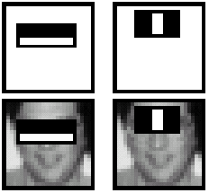

# Face-Detection-and-Recognition

## Face image classification using Gaussian model, Mixture of Gaussian model, tdistribution, Factor Analysis

__Data Preparation__  (Data_Conversion.py)
Extract 𝑛 = 1000 training images for face and non-face respectively, and 𝑚 = 100 testing images for face and non-face respectively from one of the provided 17 face datasets which has face bounding boxes
annotated, both at 20 × 20 resolution. Make sure training face images and testing face images are separate, that is no face testing images are from the same person in the training set of face
images. And, non-face images should be cropped randomly from background in the provided images in the dataset you selected.

__Tasks__  

With your own face dataset created, you can train your models and test the performance.  
For each model, report results as follows.  
* Visualize the estimated mean(s) and covariance matrix for face and non-face
respectively; 
* Evaluate the learned model on the testing images using 0.5 as threshold for the posterior.
Compute false positive rate (#negatives being classified as faces / #total negatives), and
false negative rate (#positives being classified as non-face / #total positives), and the
misclassification rate ((#false-positives + #false-negative)/#total testing images)
* Plot the ROC curve where x-axis represents false positive rate and y-axis true positive
rate (i.e, 1-false negative rate). 

## Adaptive Boosting (AdaBoost) for Face Detection
  
* Reuse the dataset from above  

* Use Harr feature. Compute the value of each Harr feature for each sample. Each feature corresponds to a weak learner. Determine the threshold between face samples and non-face samples for all the weak learners.
Calculate the classification error for each weak learner and draw the best ten features  

* Implement the Adaboost Algorithm and plot the ROC

## Convolutional Neural Networks for face image classification

* Preprocess the data and select data augmentation
* Select the architecture
* Double check that the loss is reasonable without regularization
* Check loss with high regularization
* Overfitting with small data set.
*	Checking loss with very small learning rate
*	Checking loss with very high learning rate
*	Checking loss for an upper bound for learning rate
*	Hyperparameter tuning – Course to fine
*	Model training and plots for validation loss and accuracy.

## Face Verification and Recognition

__Face Verification__ - "is this the claimed person?". For example, at some airports, you can pass through customs by letting a system scan your passport and then verifying that you (the person carrying the passport) are the correct person. A mobile phone that unlocks using your face is also using face verification. This is a 1:1 matching problem.  
__Face Recognition__ - "who is this person?". For example, the video lecture showed a face recognition video of Baidu employees entering the office without needing to otherwise identify themselves. This is a 1:K matching problem.  

FaceNet learns a neural network that encodes a face image into a vector of 128 numbers. By comparing two such vectors, you can then determine if two pictures are of the same person.

In this project, the following things were implemented:  

* Implement the triplet loss function
* Use a pretrained model to map face images into 128-dimensional encodings
* Use these encodings to perform face verification and face recognition

