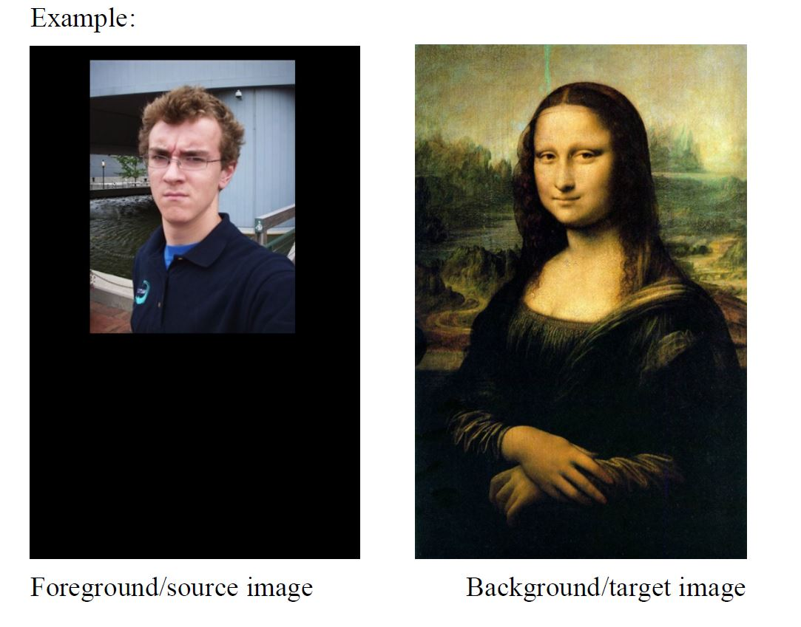
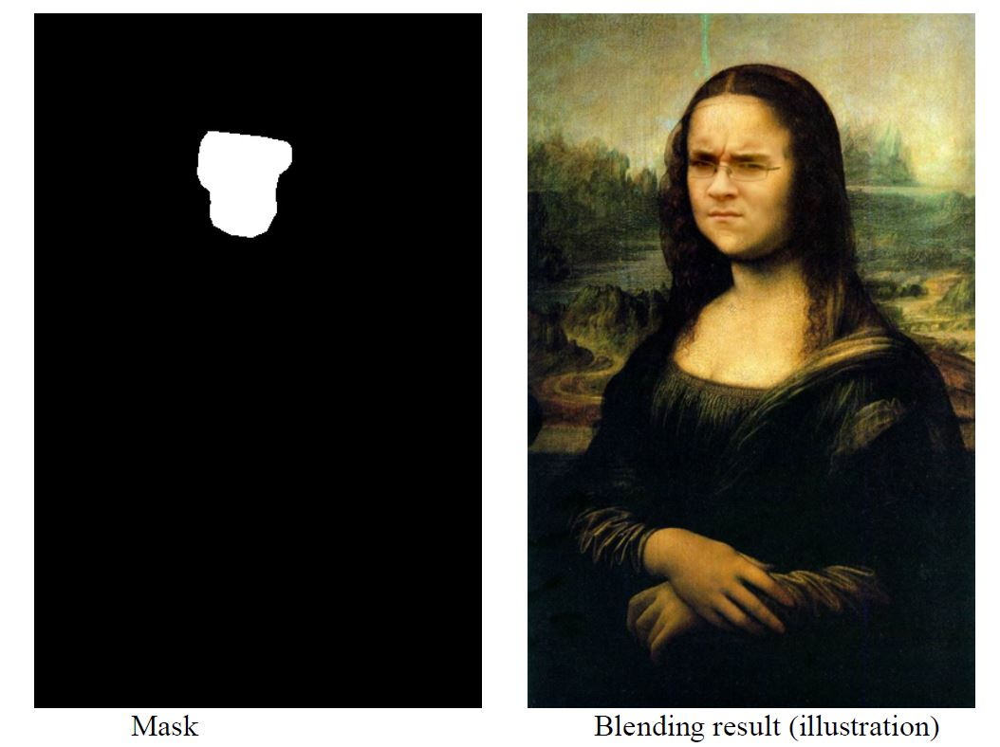
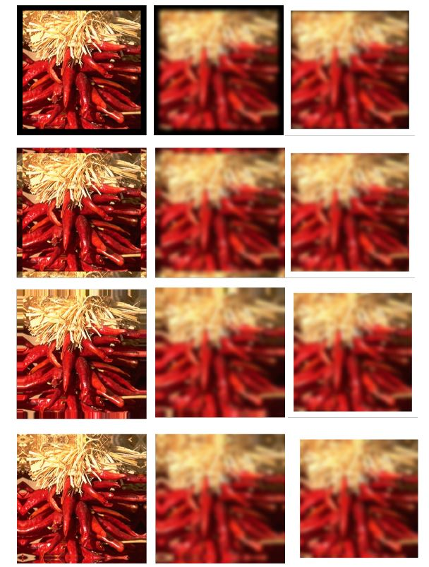
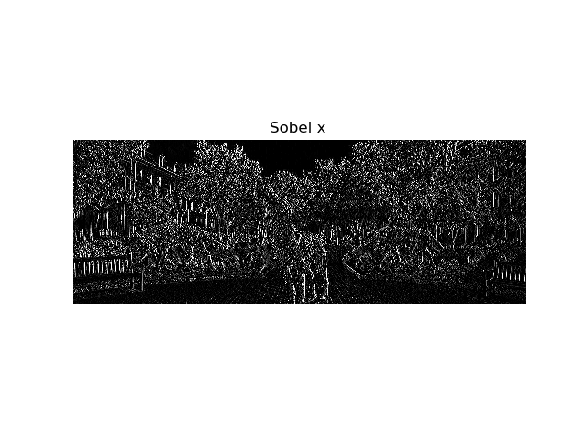

# Image Processing

This repository contains code for various project in image process domain as part of coursework at NCSU

## Image Blending
This project contains the following implementations:

* Implement Gaussian and Laplacian pyramid, 𝑔𝑃𝑦𝑟, 𝑙𝑃𝑦𝑟 = 𝐶𝑜𝑚𝑝𝑢𝑡𝑒𝑃𝑦𝑟(𝑖𝑛𝑝𝑢𝑡_𝑖𝑚𝑎𝑔𝑒, 𝑛𝑢𝑚_𝑙𝑎𝑦𝑒𝑟𝑠)  
_Input arguments_ : 𝑖𝑛𝑝𝑢𝑡_𝑖𝑚𝑎𝑔𝑒 is an input image (grey, or RGB), 𝑛𝑢𝑚_𝑙𝑎𝑦𝑒𝑟𝑠 is the number of layers of the pyramid to be computed.  
Depending on the size of 𝑖𝑛𝑝𝑢𝑡_𝑖𝑚𝑎𝑔𝑒, 𝑛𝑢𝑚_𝑙𝑎𝑦𝑒𝑟𝑠 needs to be checked if valid.  
If not, use the maximum value allowed in terms of the size of 𝑖𝑛𝑝𝑢𝑡_𝑖𝑚𝑎𝑔𝑒.  
_Outputs_: 𝑔𝑃𝑦𝑟, 𝑙𝑃𝑦𝑟 are the Gaussian pyramid and Laplacian pyramid respectively.  

* Write a simple GUI to create a black/white binary mask image. The GUI can open an image (e.g. the foreground image that you will use in blending); On the image, you can select a region of interest using either a rectangle or an eclipse, [optional] even some free-form region. Based on the opened image and the selected regions, the GUI can
generate a black/white mask image of the same size as the opened image, in which the selected region(s) are white and the remaining black.

* On top of the functions in (a) and (b), write a function to implement Laplacian pyramid blending   

Example:

## Two-dimensional_Convolution

Write a function to implement 𝑔 = 𝑐𝑜𝑛𝑣2(𝑓,𝑤, 𝑝𝑎𝑑), where 𝑓 is an input image (grey, or RGB), 𝑤 is a 2-D kernel (e.g., 3 × 3 box filter), and 𝑝𝑎𝑑 represents the 4 padding type :
clip/zero-padding, wrap around, copy edge, and reflect across edge, as illustrated in the following example

Example Output of Convolution funciton for Sobel_X  filter:

 

## 2D FFT

Using the built-in 1-D FFT to implement 𝐹 = 𝐷𝐹𝑇2(𝑓) from scratch, where 𝑓 is an input grey image.  
Using the DFT2 to implement the inverse FFT of an input transform 𝐹, 𝑔 = 𝐼𝐷𝐹𝑇2(𝐹) from scratch.  

## Smoothness Prior

Given an image 𝐼, consider all valid pairs of neighboring pixels, compute the difference between their intensity or color values, and plot the histogram.
* __Neighbors__: e.g., for a 100x100 image, consider all valid pairs of (𝑥, 𝑦) and
(𝑥 + 1, 𝑦).
* __Difference__: using the squared of difference for intensity, RGB, HSV and Lab. 
* __Histogram__: Visualize the histogram.

